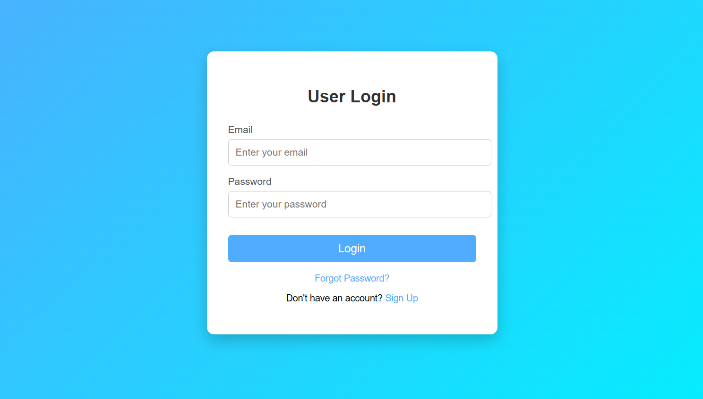

# 🔐 Login Page UI

A simple and clean **Login Page Interface** built using **HTML and CSS**.
This project demonstrates a modern login form with a gradient background and a centered card layout.

---

## 📸 Preview



## ✨ Features

🌈 Beautiful gradient background
📧 Email input field
🔑 Password input field
🖱️ Hover effect on login button
❓ Forgot Password link
📝 Sign Up option for new users
📱 Simple and responsive layout

---

## 🛠️ Built With

* 🧱 **HTML5** – Page structure
* 🎨 **CSS3** – Styling and layout


## 📂 Project Structure

```
login-page
│
├── index.html
└── README.md

## 🚀 Future Improvements

🔹 Add **JavaScript form validation**
🔹 Add **show/hide password feature 👁️**
🔹 Connect login form to a **backend database**
🔹 Improve **mobile responsiveness 📱**

## 👨‍💻 Author
Created as a **beginner frontend project** using HTML and CSS.

